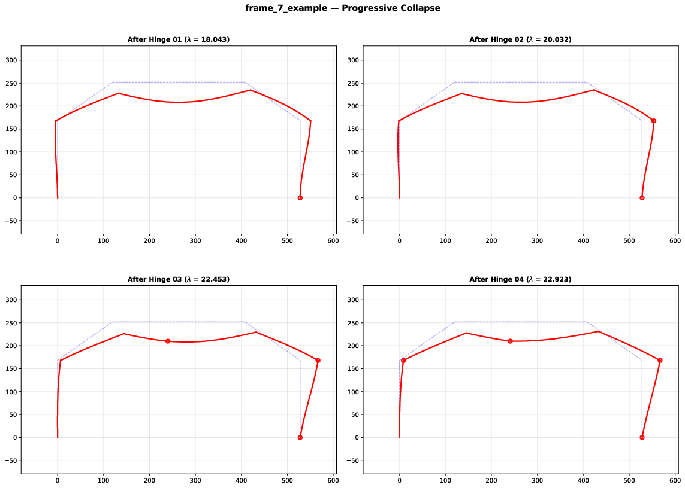
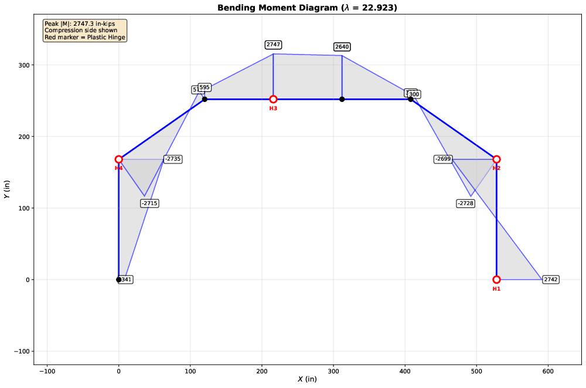
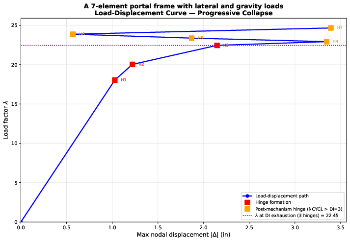

# epframe

Elastic-Plastic analysis of 2D structural frames
=======

## Overview

EPFRAME performs incremental elastic-plastic analysis of 2D plane frames using the plastic hinge method. This implementation is translated from the original FORTRAN code by Hacksoo Lee (1986) into Python with modern enhancements.

The program tracks sequential formation of plastic hinges as loads increase, automatically adjusting member stiffnesses until a collapse mechanism forms.

## Features

- **Incremental Load Analysis**: Progressive loading until collapse mechanism forms
- **Plastic Hinge Tracking**: Sequential formation of plastic hinges with load factors
- **Moment-Axial Interaction**: Axial loads reduce ultimate moments
- **Geometric Nonlinearity**: Tension forces increase stability, compression forces decreases stability
- **Unidirectional Reactions**: Reaction forces can be specified to act in only one direction
- **Automatic Stiffness Modification**: Member stiffnesses adjust as hinges form
- **Reaction Force Calculations**: Support reactions computed at each load step
- **Visualization Suite**: Automatic generation of deformed shapes, moment diagrams, shear diagrams, and axial force diagrams
- **Computation of Element Displacements Between Nodes**: Double integrating M(x)/EI between nodal displacements
- **CSV Data Export**: Compact numerical data exported to CSV for post-processing
- **Comment Support**: Input files can include `#` comments for documentation
- **Modern Python**: Uses numpy for efficient matrix operations

## Files

| File                  | Description                                      |
| --------------------- | ------------------------------------------------ |
| `epframe.py`          | Main analysis program                            |
| `epframe_viz.py`      | Visualization and plotting tools                 |
| `square_tube.py`      | Section properties of square tube cross sections |
| `beam_4_example.dat`  | Example input file (4-node beam)                 |
| `beam_7_example.dat`  | Example input file (7-node beam)                 |
| `frame_7_example.dat` | Example input file (7-node gable frame)          |

## Installation

### Requirements

```bash
pip install numpy matplotlib
```

## Usage

### Analysis Step

```bash
# Run analysis
python epframe.py input_file output_file
```

**Outputs:**

- `output_file` - Human-readable results with deformations, moments, and reactions
- `output_file.csv` - Compact numerical data for post-processing

### Visualization Step

```bash
# Generate visualization figures from analysis results 
python epframe_viz.py output_file
```

**Generated Plots in sub-directory ./plots/ :**

- `output_file-geometry.pdf` - Original frame layout with supports
- `output_file-deformed_hinge_X.pdf` - Deformed shape after each hinge
- `output_file-moments_hinge_X.pdf` - Bending moment diagrams
- `output_file-shear_hinge_X.pdf` - Shear force diagram (final state only)
- `output_file-axial_hinge_X.pdf` - Axial force diagram (final state only)
- `output_file-load_displacement.pdf` - load factor vs max displacement 
- `output_file-summary.pdf` - 4-panel progressive collapse summary

## Input File Format

```
# EPFRAME Example Input File
# Units: inches, kips, ksi

A 7-element gable frame with lateral and gravity loads

# NCT  NE   E (ksi)  Fy (ksi)
   8    7   29000    24        # 8 nodes, 7 elements, steel

# Node data: 
# Reactions in all three coordinates at nodes 1 and 8
# Node   X      Y  RX  RY  RZ
 1       0      0   1   1   1  # Left support (fixed)
 2       0    168   0   0   0  # Left column top
 3     120    252   0   0   0  # Roof nodes...
 4     216    252   0   0   0
 5     312    252   0   0   0
 6     408    252   0   0   0
 7     528    168   0   0   0  # Right column top
 8     528      0   1   1   1  # Right support (fixed)

# Element data:
# All elements: W14x68 section
# Element N1  N2  I(in^4)  A(in^2)  Z (in^3)
 1         1   2   954      19.7    115.0   # Left column
 2         2   3   954      19.7    115.0   # Roof elements
 3         3   4   954      19.7    115.0
 4         4   5   954      19.7    115.0   # Center span
 5         5   6   954      19.7    115.0
 6         6   7   954      19.7    115.0
 7         7   8   954      19.7    115.0   # Right column

# Number of loaded nodes
5

# Load data:
# Lateral load at node 2, gravity loads at roof nodes
# Node  FX(kips)  FY(kips)  MZ(in-kips)
 2       0.5       0         0    # Lateral push
 3       0.25     -1         0    # Combined lateral + gravity
 4       0        -1         0    # Gravity only
 5       0        -1         0
 6       0        -1         0

# End of input file
```

## Output Format

### Main Output File

```
%
%     A 7-element gable frame with lateral and gravity loads
%     -------------------------------------------------------
%
%     * GENERAL DATA
%          NUMBER OF NODES              8
%          NUMBER OF ELEMENTS           7
%          MOD OF ELASTICITY       29000.0
%          YIELD STRESS               24.0
%          STATIC INDETERMINACY         3   (mechanism forms after 4 hinges)
%          DISPLACEMENT LIMIT        52.80   (0.10 × max frame dimension)
%
%
%     * DATA FOR NODES
%           NODE   X-COORD   Y-COORD    RX-TYPE  RY-TYPE  RZ-TYPE
%
%             1        0.00      0.00        BI       BI       BI
%             2        0.00    168.00      FREE     FREE     FREE
%             3      120.00    252.00      FREE     FREE     FREE
%             4      216.00    252.00      FREE     FREE     FREE
%             5      312.00    252.00      FREE     FREE     FREE
%             6      408.00    252.00      FREE     FREE     FREE
%             7      528.00    168.00      FREE     FREE     FREE
%             8      528.00      0.00        BI       BI       BI
%
%     * DATA FOR ELEMENTS
%         ELEMENT    N1      N2       IXX      AREA         Z        MP        PY
%
%             1        1       2    954.00     19.70    115.00   2760.00    472.80
%             2        2       3    954.00     19.70    115.00   2760.00    472.80
%             3        3       4    954.00     19.70    115.00   2760.00    472.80
%             4        4       5    954.00     19.70    115.00   2760.00    472.80
%             5        5       6    954.00     19.70    115.00   2760.00    472.80
%             6        6       7    954.00     19.70    115.00   2760.00    472.80
%             7        7       8    954.00     19.70    115.00   2760.00    472.80
%
%     * DATA FOR LOADS
%           NODE        PX        PY        PZ
%             2        0.50      0.00      0.00
%             3        0.25     -1.00      0.00
%             4        0.00     -1.00      0.00
%             5        0.00     -1.00      0.00
%             6        0.00     -1.00      0.00
%
%
%
%     * PLASTIC HINGE   1 FORMED IN ELEMENT   7 NEAR NODE   8 WHEN LOAD FACTOR IS       18.043
%
%     ACTIVE SUPPORT STATUS:
%
%          CUMULATIVE DEFORMATIONS
%                NODE    X-DISP       Y-DISP       ROTN
%                  1      0.00000      0.00000      0.00000
%                  2     -0.08832     -0.01004     -0.00180
%                  3      0.28901     -0.56728     -0.00569
%                  4      0.28392     -0.98855     -0.00220
%                  5      0.27884     -0.91342      0.00365
%                  6      0.27375     -0.40373      0.00586
%                  7      0.53395     -0.01118     -0.00121
%                  8      0.00000      0.00000      0.00000
%
%          CUMULATIVE MOMENTS
%             ELEMENT       END MOMENTS             NODES     PLASTIC MOM   ULTIMATE MOM      P / Py
%                  1      -1110.70   -1701.94      1 AND  2       2760.00       2745.60    -0.0722
%                  2       1701.94     232.31      2 AND  3       2760.00       2739.56    -0.0861
%                  3       -232.31    1778.85      3 AND  4       2760.00       2748.68    -0.0640
%                  4      -1778.85    1593.23      4 AND  5       2760.00       2748.68    -0.0640
%                  5      -1593.23    -324.56      5 AND  6       2760.00       2748.68    -0.0640
%                  6        324.56   -2343.96      6 AND  7       2760.00       2733.18    -0.0986
%                  7       2343.96    2742.15      7 AND  8       2760.00       2742.15    -0.0804
%
%          CUMULATIVE TENSION FORCES
%             ELEMENT     TENSION
%                  1         -34.15
%                  2         -40.69
%                  3         -30.27
%                  4         -30.27
%                  5         -30.27
%                  6         -46.61
%                  7         -38.02
%
%          REACTIONS AT SUPPORTS
%                NODE       FX           FY           MZ         STATUS
%                  1        16.74        34.15      1110.70    ACTIVE
%                  8       -30.27        38.02     -2742.15    ACTIVE
%
%
%
%     * PLASTIC HINGE   2 FORMED IN ELEMENT   6 NEAR NODE   7 WHEN LOAD FACTOR IS       20.032
%
%     ACTIVE SUPPORT STATUS:
%
%          CUMULATIVE DEFORMATIONS
%                NODE    X-DISP       Y-DISP       ROTN
%                  1      0.00000      0.00000      0.00000
%                  2     -0.04152     -0.01107     -0.00248
%                  3      0.40979     -0.67552     -0.00653
%                  4      0.40432     -1.15177     -0.00241
%                  5      0.39886     -1.05665      0.00425
%                  6      0.39340     -0.46767      0.00677
%                  7      0.69606     -0.01249     -0.00140
%                  8      0.00000      0.00000      0.00000
%
%          CUMULATIVE MOMENTS
%             ELEMENT       END MOMENTS             NODES     PLASTIC MOM   ULTIMATE MOM      P / Py
%                  1      -1059.87   -1875.56      1 AND  2       2760.00       2742.50    -0.0796
%                  2       1873.98     341.01      2 AND  3       2760.00       2735.96    -0.0933
%                  3       -342.56    2036.16      3 AND  4       2760.00       2746.95    -0.0688
%                  4      -2036.40    1803.82      4 AND  5       2760.00       2746.95    -0.0688
%                  5      -1803.12    -354.99      5 AND  6       2760.00       2746.95    -0.0688
%                  6        356.75   -2727.90      6 AND  7       2760.00       2727.90    -0.1079
%                  7       2727.09    2742.15      7 AND  8       2760.00       2737.72    -0.0898
%
%          CUMULATIVE TENSION FORCES
%             ELEMENT     TENSION
%                  1         -37.65
%                  2         -44.12
%                  3         -32.51
%                  4         -32.51
%                  5         -32.51
%                  6         -50.99
%                  7         -42.48
%
%          REACTIONS AT SUPPORTS
%                NODE       FX           FY           MZ         STATUS
%                  1        17.47        37.65      1059.87    ACTIVE
%                  8       -32.56        42.48     -2742.15    ACTIVE
%
%
%
%     * PLASTIC HINGE   3 FORMED IN ELEMENT   4 NEAR NODE   4 WHEN LOAD FACTOR IS       22.453
%
%     ACTIVE SUPPORT STATUS:
%
%          CUMULATIVE DEFORMATIONS
%                NODE    X-DISP       Y-DISP       ROTN
%                  1      0.00000      0.00000      0.00000
%                  2      0.28966     -0.01268     -0.00602
%                  3      1.06487     -1.14086     -0.01003
%                  4      1.05947     -1.86809     -0.00397
%                  5      1.05408     -1.80092      0.00527
%                  6      1.04869     -0.99639      0.01014
%                  7      1.71994     -0.01373     -0.00752
%                  8      0.00000      0.00000      0.00000
%
%          CUMULATIVE MOMENTS
%             ELEMENT       END MOMENTS             NODES     PLASTIC MOM   ULTIMATE MOM      P / Py
%                  1       -279.71   -2263.04      1 AND  2       2760.00       2737.05    -0.0912
%                  2       2252.42     739.25      2 AND  3       2760.00       2733.40    -0.0982
%                  3       -747.65    2745.09      3 AND  4       2760.00       2747.28    -0.0679
%                  4      -2747.28    2576.00      4 AND  5       2760.00       2747.28    -0.0679
%                  5      -2574.03     233.75      5 AND  6       2760.00       2747.28    -0.0679
%                  6       -221.82   -2727.90      6 AND  7       2760.00       2725.23    -0.1122
%                  7       2713.26    2742.15      7 AND  8       2760.00       2733.08    -0.0988
%
%          CUMULATIVE TENSION FORCES
%             ELEMENT     TENSION
%                  1         -43.12
%                  2         -46.42
%                  3         -32.09
%                  4         -32.09
%                  5         -32.09
%                  6         -53.07
%                  7         -46.69
%
%          REACTIONS AT SUPPORTS
%                NODE       FX           FY           MZ         STATUS
%                  1        15.14        43.12       279.71    ACTIVE
%                  8       -32.47        46.69     -2742.15    ACTIVE
%     *** WARNING: HINGE COUNT (4) EXCEEDS DEGREE OF STATIC INDETERMINACY (3) — KINEMATIC MECHANISM LIKELY
%
%
%
%     * PLASTIC HINGE   4 FORMED IN ELEMENT   1 NEAR NODE   2 WHEN LOAD FACTOR IS       22.923
%
%     ACTIVE SUPPORT STATUS:
%
%          CUMULATIVE DEFORMATIONS
%                NODE    X-DISP       Y-DISP       ROTN
%                  1      0.00000      0.00000      0.00000
%                  2      0.58087     -0.01320     -0.00934
%                  3      1.71522     -1.65472     -0.01500
%                  4      1.70990     -2.87657     -0.00921
%                  5      1.70458     -2.52320      0.00833
%                  6      1.69926     -1.41246      0.01347
%                  7      2.66183     -0.01376     -0.01316
%                  8      0.00000      0.00000      0.00000
%
%          CUMULATIVE MOMENTS
%             ELEMENT       END MOMENTS             NODES     PLASTIC MOM   ULTIMATE MOM      P / Py
%                  1        340.59   -2735.11      1 AND  2       2760.00       2735.11    -0.0950
%                  2       2715.24     576.53      2 AND  3       2760.00       2732.73    -0.0994
%                  3       -594.68    2740.31      3 AND  4       2760.00       2747.62    -0.0670
%                  4      -2747.28    2646.48      4 AND  5       2760.00       2747.62    -0.0670
%                  5      -2639.91     321.53      5 AND  6       2760.00       2747.62    -0.0670
%                  6       -299.97   -2727.90      6 AND  7       2760.00       2725.61    -0.1116
%                  7       2698.96    2742.15      7 AND  8       2760.00       2732.97    -0.0990
%
%          CUMULATIVE TENSION FORCES
%             ELEMENT     TENSION
%                  1         -44.90
%                  2         -47.00
%                  3         -31.67
%                  4         -31.67
%                  5         -31.67
%                  6         -52.78
%                  7         -46.79
%
%          REACTIONS AT SUPPORTS
%                NODE       FX           FY           MZ         STATUS
%                  1        14.25        44.90      -340.59    ACTIVE
%                  8       -32.39        46.79     -2742.15    ACTIVE
%     *** WARNING: HINGE COUNT (5) EXCEEDS DEGREE OF STATIC INDETERMINACY (3) — KINEMATIC MECHANISM LIKELY
%
%
%
%     * PLASTIC HINGE   5 FORMED IN ELEMENT   2 NEAR NODE   2 WHEN LOAD FACTOR IS       23.372
%
%     ACTIVE SUPPORT STATUS:
%
%          CUMULATIVE DEFORMATIONS
%                NODE    X-DISP       Y-DISP       ROTN
%                  1      0.00000      0.00000      0.00000
%                  2      0.57287     -0.01348     -0.00241
%                  3      1.12709     -0.82659     -0.00811
%                  4      1.12169     -1.38768     -0.00233
%                  5      1.11629     -1.49918      0.00351
%                  6      1.11090     -0.84729      0.00872
%                  7      1.67741     -0.01401     -0.00727
%                  8      0.00000      0.00000      0.00000
%
%          CUMULATIVE MOMENTS
%             ELEMENT       END MOMENTS             NODES     PLASTIC MOM   ULTIMATE MOM      P / Py
%                  1        317.08   -2735.11      1 AND  2       2760.00       2734.06    -0.0970
%                  2       2731.78     578.38      2 AND  3       2760.00       2731.78    -0.1011
%                  3       -582.85    2746.30      3 AND  4       2760.00       2747.27    -0.0679
%                  4      -2747.28    2667.60      4 AND  5       2760.00       2747.27    -0.0679
%                  5      -2668.07     331.08      5 AND  6       2760.00       2747.27    -0.0679
%                  6       -322.46   -2727.90      6 AND  7       2760.00       2724.49    -0.1134
%                  7       2713.39    2742.15      7 AND  8       2760.00       2731.97    -0.1008
%
%          CUMULATIVE TENSION FORCES
%             ELEMENT     TENSION
%                  1         -45.84
%                  2         -47.80
%                  3         -32.11
%                  4         -32.11
%                  5         -32.11
%                  6         -53.63
%                  7         -47.65
%
%          REACTIONS AT SUPPORTS
%                NODE       FX           FY           MZ         STATUS
%                  1        14.39        45.84      -317.08    ACTIVE
%                  8       -32.47        47.65     -2742.15    ACTIVE
%     *** WARNING: HINGE COUNT (6) EXCEEDS DEGREE OF STATIC INDETERMINACY (3) — KINEMATIC MECHANISM LIKELY
%
%
%
%     * PLASTIC HINGE   6 FORMED IN ELEMENT   7 NEAR NODE   7 WHEN LOAD FACTOR IS       23.870
%
%     ACTIVE SUPPORT STATUS:
%
%          CUMULATIVE DEFORMATIONS
%                NODE    X-DISP       Y-DISP       ROTN
%                  1      0.00000      0.00000      0.00000
%                  2      0.56408     -0.01377     -0.00437
%                  3      0.43140      0.15400      0.00009
%                  4      0.42591      0.37967      0.00587
%                  5      0.42043     -0.28227     -0.00220
%                  6      0.41494     -0.17486      0.00307
%                  7      0.51023     -0.01430     -0.00028
%                  8      0.00000      0.00000      0.00000
%
%          CUMULATIVE MOMENTS
%             ELEMENT       END MOMENTS             NODES     PLASTIC MOM   ULTIMATE MOM      P / Py
%                  1        291.24   -2735.11      1 AND  2       2760.00       2732.91    -0.0991
%                  2       2731.78     591.40      2 AND  3       2760.00       2730.70    -0.1030
%                  3       -576.98    2753.54      3 AND  4       2760.00       2746.84    -0.0690
%                  4      -2747.28    2688.63      4 AND  5       2760.00       2746.84    -0.0690
%                  5      -2697.57     337.76      5 AND  6       2760.00       2746.84    -0.0690
%                  6       -344.78   -2727.90      6 AND  7       2760.00       2723.15    -0.1156
%                  7       2730.79    2742.15      7 AND  8       2760.00       2730.79    -0.1029
%
%          CUMULATIVE TENSION FORCES
%             ELEMENT     TENSION
%                  1         -46.84
%                  2         -48.72
%                  3         -32.64
%                  4         -32.64
%                  5         -32.64
%                  6         -54.63
%                  7         -48.64
%
%          REACTIONS AT SUPPORTS
%                NODE       FX           FY           MZ         STATUS
%                  1        14.55        46.84      -291.24    ACTIVE
%                  8       -32.58        48.64     -2742.15    ACTIVE
%     *** WARNING: HINGE COUNT (7) EXCEEDS DEGREE OF STATIC INDETERMINACY (3) — KINEMATIC MECHANISM LIKELY
%
%
%
%     * PLASTIC HINGE   7 FORMED IN ELEMENT   5 NEAR NODE   5 WHEN LOAD FACTOR IS       24.664
%
%     ACTIVE SUPPORT STATUS:
%
%          CUMULATIVE DEFORMATIONS
%                NODE    X-DISP       Y-DISP       ROTN
%                  1      0.00000      0.00000      0.00000
%                  2      0.56122     -0.01424     -0.00760
%                  3     -0.71220      1.78258      0.01372
%                  4     -0.71779      3.31660      0.01951
%                  5     -0.72339      1.73984     -0.01169
%                  6     -0.72899      0.94244     -0.00631
%                  7     -1.41659     -0.01477     -0.00233
%                  8      0.00000      0.00000      0.00000
%
%          CUMULATIVE MOMENTS
%             ELEMENT       END MOMENTS             NODES     PLASTIC MOM   ULTIMATE MOM      P / Py
%                  1        282.83   -2735.11      1 AND  2       2760.00       2731.04    -0.1024
%                  2       2731.78     619.32      2 AND  3       2760.00       2729.13    -0.1058
%                  3       -572.94    2765.79      3 AND  4       2760.00       2746.31    -0.0704
%                  4      -2747.28    2723.05      4 AND  5       2760.00       2746.31    -0.0704
%                  5      -2746.31     351.56      5 AND  6       2760.00       2746.31    -0.0704
%                  6       -381.37   -2727.90      6 AND  7       2760.00       2721.16    -0.1186
%                  7       2730.79    2742.15      7 AND  8       2760.00       2728.85    -0.1062
%
%          CUMULATIVE TENSION FORCES
%             ELEMENT     TENSION
%                  1         -48.43
%                  2         -50.00
%                  3         -33.30
%                  4         -33.30
%                  5         -33.30
%                  6         -56.09
%                  7         -50.23
%
%          REACTIONS AT SUPPORTS
%                NODE       FX           FY           MZ         STATUS
%                  1        14.60        48.43      -282.83    ACTIVE
%                  8       -32.58        50.23     -2742.15    ACTIVE
%
%     *** CUMULATIVE DISPLACEMENT 198.22 EXCEEDS LIMIT 52.80 (0.10 × max frame dimension) IN CYCLE 8
%
%
%     ANALYSIS COMPLETED: A 7-element gable frame with lateral and gravity loads AT LOAD FACTOR 82.485
```

### CSV Output File

The CSV file contains one header row followed by data rows for each load step:

```csv
NCYCL,EL,NH,CLF,CD1_X,CD1_Y,CD1_R,...,CM1_1,CM1_2,...,CT1,...
0,0,0,0.000000E+00,0.000000E+00,...
1,7,8,3.079452E+01,-1.507380E-01,...
```

Columns:

- `NCYCL` - Cycle number (0=initial, 1+=after each hinge)
- `EL` - Element where hinge formed
- `NH` - Node where hinge formed
- `CLF` - Cumulative load factor (lambda)
- `CDn_X/Y/R` - Cumulative displacements at node n
- `CMn_1/2` - Cumulative moments at element n ends
- `CTn` - Cumulative tension forces in element n

## Algorithm

**1. Initialization**

- Parse title, material properties (E, Fy), section properties (I, A, Z), and support conditions (bidirectional, unidirectional +/−, or free) from input file
- Derive plastic moment Mp = Z·Fy and axial yield force Py = A·Fy for each element
- Build compatibility matrix **K** from frame geometry and element connectivity
- Calculate initial elastic member flexibilities SF (bending) and SA (axial)
- Compute degree of static indeterminacy DI = 3·NE − ND and displacement limit DLMT = 0.1 × max frame dimension
- Write initial state to output and CSV files

**2. Load Increment Loop**

- Form elastic element stiffness matrix **S** from current SF and SA (modified at prior hinge locations)

- Form global elastic stiffness: **K**_e = **K** · **S** · **K**^T

- Assemble geometric stiffness **K**_g by transforming and scattering the 6×6 element geometric stiffness matrices (eq. 75, Bernoulli-Euler) weighted by current cumulative axial forces CT; add to form total stiffness: **K**_sat = **K**_e + **K**_g

- Check for geometric instability: if **K**_sat has a negative eigenvalue, report buckling and stop

- Solve for displacement rates δ using active-set iteration to enforce unidirectional reaction constraints: **K**_sat · δ = **P**, releasing any unidirectional support whose reaction force would act in the wrong direction

- Calculate member force rates: **F** = **S** · **K**^T · δ; separate into moment rates (SATX_e2) and axial force rates (SATX_ct)

- Check for compression yield: if |CT[el]| ≥ Py[el] for any element, report and stop

- Warn if hinge count already exceeds DI (kinematic mechanism masked by geometric stiffness)

- Find load factor α to next P-M hinge by solving the quadratic at each element end:
  
  (Mp·ṗ²/Py²)·α² + (s·ṁ + 2·Mp·P₀·ṗ/Py²)·α + (s·M₀ − Mp(1 − P₀²/Py²)) = 0
  
  where s = sign(M₀), ṁ = moment rate, ṗ = axial force rate, M₀ and P₀ are cumulative values; reduces exactly to the linear formula (Mp − |M₀|)/|ṁ| when ṗ ≈ 0

- Scale all rates by α; update cumulative displacements CD, moments CM, and axial forces CT

- Check cumulative displacements against DLMT; stop if exceeded

- Write hinge location, active support status, deformations, moments (with Mp, Mu = Mp(1−(P/Py)²), and P/Py), axial forces, and reactions to output file

**3. Plastic Hinge Modification**

- At the hinge end (near-end): set both SF entries to zero — bending stiffness goes to zero, moment is locked at current CM value
- At the far end of the same element: reduce the diagonal SF entry to 75% of its current value (4EI/L → 3EI/L for an intact element, reflecting the loss of far-end rotational restraint) and set the off-diagonal SF entry to zero

**4. Termination Conditions** (in order of priority)

- **Geometric instability (buckling):** minimum eigenvalue of **K**_sat < 0 before a hinge is found
- **Collapse mechanism:** **K**_sat is singular (solve returns None); distinguished from buckling by the sign of the minimum eigenvalue — zero eigenvalue is a mechanism, negative is buckling
- **Compression yield:** |P| ≥ Py in any element, signalling material instability in axial compression
- **Displacement limit:** any cumulative nodal displacement exceeds DLMT = 0.1 × max(frame span, frame height) — enforced on CD after each update, not on the unscaled rate vector
- **No further hinge possible:** all α values exceed 10⁹ (all element ends are either already at Mu or relieving)
- **Kinematic mechanism warning:** hinge count exceeds DI; analysis continues only if geometric stiffness keeps **K**_sat non-singular, and the warning is written to the output file at each such increment

## Example Results

For the 7-element gable frame example:

| Hinge | Element | Node | Load Factor |
| ----- | ------- | ---- | ----------- |
| 1     | 7       | 8    | 18.043      |
| 2     | 6       | 7    | 20.023      |
| 3     | 4       | 4    | 22.453      |
| 4     | 1       | 2    | 22.923      |

The frame forms a collapse mechanism after 4 plastic hinges at a load factor of 40.297.

## Visualization Examples

### Progressive Collapse



### Bending Moment Diagram



### Load Displacement Diagram



## Limitations

- 2D plane frames only (no 3D analysis)
- Concentrated loads at nodes only (no distributed loads)
- Elastic-perfectly plastic material model

## Troubleshooting

**"Singular matrix" or "DIVISION BY ZERO" error:**

- Check for unstable geometry (mechanism before loading)
- Verify support conditions provide adequate restraint
- Ensure all elements are properly connected

**"Deformations exceed Limit":**

- Collapse mechanism has formed (expected behavior)
- If unexpected, check plastic moment capacities

**Unexpected results:**

- Verify consistent units throughout input
- Check element connectivity (N1, N2 assignments)from
- Confirm DOF flags (0=fixed, 1=free)
- Review applied load directions and magnitudes

## References

1. Hacksoo Lee and Subhash Goel, "EPFRAME.F", University of Michigan, 1986
2. Neal, B.G., "The Plastic Methods of Structural Analysis", Chapman & Hall
3. Chen, W.F. and Sohal, I., "Plastic Design and Second-Order Analysis of Steel Frames", Springer

## License

This implementation is based on public domain FORTRAN code and is now licensed under the MIT License.  

## Author

Original FORTRAN: Hacksoo Lee and Subhash Goel, University of Michigan (1986) 
Python Translation: Duke University Civil & Environmental Engineering
