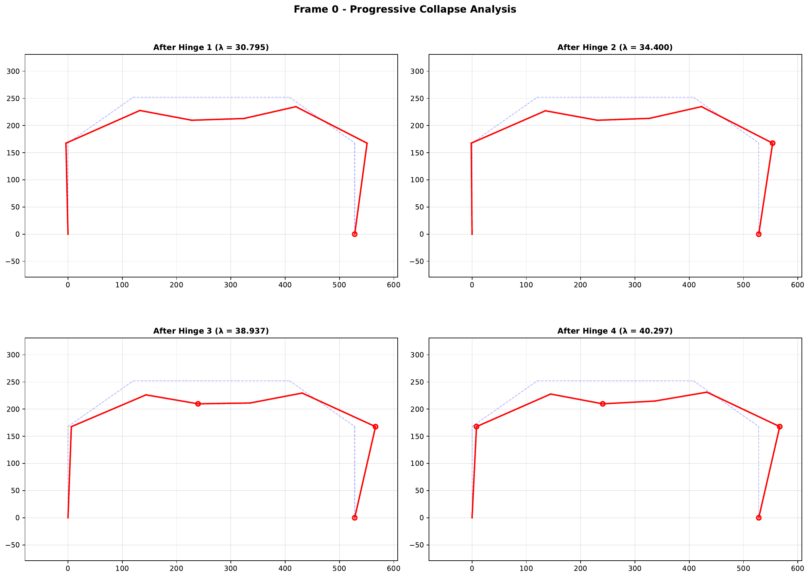
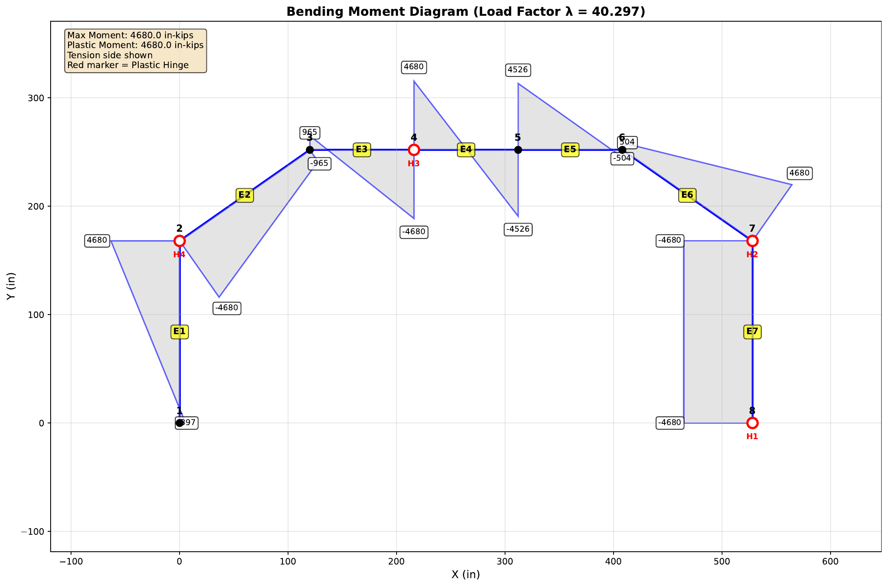

# epframe

Elastic-Plastic analysis of 2D structural frames
=======

## Overview

EPFRAME performs incremental elastic-plastic analysis of 2D plane frames using the plastic hinge method. This implementation is translated from the original FORTRAN code by Hacksoo Lee (1986) into Python with modern enhancements.

The program tracks sequential formation of plastic hinges as loads increase, automatically adjusting member stiffnesses until a collapse mechanism forms.

## Features

- **Incremental Load Analysis**: Progressive loading until collapse mechanism forms
- **Plastic Hinge Tracking**: Sequential formation of plastic hinges with load factors
- **Automatic Stiffness Modification**: Member stiffnesses adjust as hinges form
- **Reaction Force Calculations**: Support reactions computed at each load step
- **Visualization Suite**: Automatic generation of deformed shapes, moment diagrams, shear diagrams, and axial force diagrams
- **CSV Data Export**: Compact numerical data exported to CSV for post-processing
- **Comment Support**: Input files can include `#` comments for documentation
- **Modern Python**: Uses numpy for efficient matrix operations

## Files

| File                    | Description                                 |
| ----------------------- | ------------------------------------------- |
| `epframe.py`            | Main analysis program                       |
| `epframe_viz.py`        | Visualization and plotting tools            |
| `epframe_example_0.dat` | Example input file (7-element portal frame) |

## Installation

### Requirements

```bash
pip install numpy matplotlib
```

## Usage

### Analysis Step

```bash
# Run analysis
python epframe.py input_file output_file
```

**Outputs:**

- `output_file` - Human-readable results with deformations, moments, and reactions
- `output_file.csv` - Compact numerical data for post-processing

### Visualization Step

```bash
# Generate visualization figures from analysis results 
python epframe_viz.py output_file
```

**Generated Plots in sub-directory ./plots/ :**

- `frame_N_geometry.pdf` - Original frame layout with supports
- `frame_N_deformed_hinge_X.pdf` - Deformed shape after each hinge
- `frame_N_moments_hinge_X.pdf` - Bending moment diagrams
- `frame_N_shear_X.pdf` - Shear force diagram (final state only)
- `frame_N_axial_X.pdf` - Axial force diagram (final state only)
- `frame_N_summary.pdf` - 4-panel progressive collapse summary

## Input File Format

```
# EPFRAME Example Input File
# 7-element portal frame with lateral and gravity loads
# Units: inches, kips, ksi

0                              # Frame number

# NCT  NE   E (ksi)
   8    7   29000              # 8 nodes, 7 elements, steel

# Node data: 
# Reactions in all three coordinates at nodes 1 and 8 
# Node   X      Y  RX  RY  RZ
 1       0      0   1   1   1  # Left support (fixed)
 2       0    168   0   0   0  # Left column top
 3     120    252   0   0   0  # Roof nodes...
 4     216    252   0   0   0
 5     312    252   0   0   0
 6     408    252   0   0   0
 7     528    168   0   0   0  # Right column top
 8     528      0   1   1   1  # Right support (fixed)

# Element data:
# All elements: W14x68 section
# Element N1  N2  I(in^4)  A(in^2)  Mp(in-kips)
 1         1   2   954      19.7    4680   # Left column
 2         2   3   954      19.7    4680   # Roof elements
 3         3   4   954      19.7    4680
 4         4   5   954      19.7    4680   # Center span
 5         5   6   954      19.7    4680
 6         6   7   954      19.7    4680
 7         7   8   954      19.7    4680   # Right column

# Number of loaded nodes
5

# Load data:
# Lateral load at node 2, gravity loads at roof nodes
# Node  FX(kips)  FY(kips)  MZ(in-kips)
 2       0.5       0         0    # Lateral push
 3       0.25     -1         0    # Combined lateral + gravity
 4       0        -1         0    # Gravity only
 5       0        -1         0
 6       0        -1         0

# End of input file
```

## Output Format

### Main Output File

```
%
%     ELASTIC PLASTIC ANALYSIS OF FRAME NO 0
%     ---------------------------------------
%
%     * GENERAL DATA
%          NUMBER OF NODES              8
%          NUMBER OF ELEMENTS           7
%          MOD OF ELASTICITY       29000.0
%
%
%     * DATA FOR NODES
%           NODE   X-COORD   Y-COORD    RX    RY    RZ
%
%             1        0.00      0.00     1     1     1
%             2        0.00    168.00     0     0     0
%             3      120.00    252.00     0     0     0
%             4      216.00    252.00     0     0     0
%             5      312.00    252.00     0     0     0
%             6      408.00    252.00     0     0     0
%             7      528.00    168.00     0     0     0
%             8      528.00      0.00     1     1     1
%
%     * DATA FOR ELEMENTS
%         ELEMENT    N1      N2       IXX      AREA        MP
%
%             1        1       2    954.00     19.70   4680.00
%             2        2       3    954.00     19.70   4680.00
%             3        3       4    954.00     19.70   4680.00
%             4        4       5    954.00     19.70   4680.00
%             5        5       6    954.00     19.70   4680.00
%             6        6       7    954.00     19.70   4680.00
%             7        7       8    954.00     19.70   4680.00
%
%     * DATA FOR LOADS
%           NODE        PX        PY        PZ
%             2        0.50      0.00      0.00
%             3        0.25     -1.00      0.00
%             4        0.00     -1.00      0.00
%             5        0.00     -1.00      0.00
%             6        0.00     -1.00      0.00
%
%
%
%     * PLASTIC HINGE   1 FORMED IN ELEMENT   7 NEAR NODE   8 WHEN LOAD FACTOR IS       30.795
%
%          CUMULATIVE DEFORMATIONS
%                NODE    X-DISP       Y-DISP       ROTN
%                  1      0.00000      0.00000      0.00000
%                  2     -0.15074     -0.01714      0.00306
%                  3      0.49325     -0.96818      0.00970
%                  4      0.48457     -1.68715      0.00375
%                  5      0.47589     -1.55893     -0.00624
%                  6      0.46721     -0.68904     -0.00999
%                  7      0.91128     -0.01908      0.00206
%                  8      0.00000      0.00000      0.00000
%
%          CUMULATIVE MOMENTS
%             ELEMENT       END MOMENTS             NODES     PLASTIC MOM
%                  1       1895.62    2904.68      1 AND 2       4680.00
%                  2      -2904.68    -396.48      2 AND 3       4680.00
%                  3        396.48   -3035.95      3 AND 4       4680.00
%                  4       3035.95   -2719.15      4 AND 5       4680.00
%                  5       2719.15     553.93      5 AND 6       4680.00
%                  6       -553.93    4000.41      6 AND 7       4680.00
%                  7      -4000.41   -4680.00      7 AND 8       4680.00
%
%          CUMULATIVE TENSION FORCES
%             ELEMENT     TENSION
%                  1         -58.29
%                  2         -69.45
%                  3         -51.67
%                  4         -51.67
%                  5         -51.67
%                  6         -79.54
%                  7         -64.89
%
%          REACTIONS AT SUPPORTS
%                NODE       FX           FY           MZ
%                  1        28.57        58.29     -1895.62
%                  8       -51.67        64.89      4680.00
%
%
%
%     * PLASTIC HINGE   2 FORMED IN ELEMENT   7 NEAR NODE   7 WHEN LOAD FACTOR IS       34.400
%
%          CUMULATIVE DEFORMATIONS
%                NODE    X-DISP       Y-DISP       ROTN
%                  1      0.00000      0.00000      0.00000
%                  2     -0.06975     -0.01901      0.00426
%                  3      0.70473     -1.15926      0.01121
%                  4      0.69537     -1.97622      0.00413
%                  5      0.68601     -1.81340     -0.00729
%                  6      0.67665     -0.80335     -0.01161
%                  7      1.19660     -0.02145      0.00239
%                  8      0.00000      0.00000      0.00000
%
%          CUMULATIVE MOMENTS
%             ELEMENT       END MOMENTS             NODES     PLASTIC MOM
%                  1       1811.96    3213.66      1 AND 2       4680.00
%                  2      -3213.66    -587.26      2 AND 3       4680.00
%                  3        587.26   -3491.69      3 AND 4       4680.00
%                  4       3491.69   -3093.74      4 AND 5       4680.00
%                  5       3093.74     606.60      5 AND 6       4680.00
%                  6       -606.60    4680.00      6 AND 7       4680.00
%                  7      -4680.00   -4680.00      7 AND 8       4680.00
%
%          CUMULATIVE TENSION FORCES
%             ELEMENT     TENSION
%                  1         -64.65
%                  2         -75.67
%                  3         -55.71
%                  4         -55.71
%                  5         -55.71
%                  6         -87.47
%                  7         -72.95
%
%          REACTIONS AT SUPPORTS
%                NODE       FX           FY           MZ
%                  1        29.91        64.65     -1811.96
%                  8       -55.71        72.95      4680.00
%
%
%
%     * PLASTIC HINGE   3 FORMED IN ELEMENT   4 NEAR NODE   4 WHEN LOAD FACTOR IS       38.937
%
%          CUMULATIVE DEFORMATIONS
%                NODE    X-DISP       Y-DISP       ROTN
%                  1      0.00000      0.00000      0.00000
%                  2      0.46343     -0.02200      0.01002
%                  3      1.77180     -1.92712      0.01702
%                  4      1.76244     -3.16360      0.00675
%                  5      1.75307     -3.04862     -0.00898
%                  6      1.74371     -1.68029     -0.01720
%                  7      2.87444     -0.02380     -0.00574
%                  8      0.00000      0.00000      0.00000
%
%          CUMULATIVE MOMENTS
%             ELEMENT       END MOMENTS             NODES     PLASTIC MOM
%                  1        576.12    3877.83      1 AND 2       4680.00
%                  2      -3877.83   -1236.57      2 AND 3       4680.00
%                  3       1236.57   -4680.00      3 AND 4       4680.00
%                  4       4680.00   -4385.48      4 AND 5       4680.00
%                  5       4385.48    -353.02      5 AND 6       4680.00
%                  6        353.02    4680.00      6 AND 7       4680.00
%                  7      -4680.00   -4680.00      7 AND 8       4680.00
%
%          CUMULATIVE TENSION FORCES
%             ELEMENT     TENSION
%                  1         -74.81
%                  2         -80.57
%                  3         -55.71
%                  4         -55.71
%                  5         -55.71
%                  6         -92.06
%                  7         -80.94
%
%          REACTIONS AT SUPPORTS
%                NODE       FX           FY           MZ
%                  1        26.51        74.81      -576.12
%                  8       -55.71        80.94      4680.00
%
%
%
%     * PLASTIC HINGE   4 FORMED IN ELEMENT   2 NEAR NODE   2 WHEN LOAD FACTOR IS       40.297
%
%          CUMULATIVE DEFORMATIONS
%                NODE    X-DISP       Y-DISP       ROTN
%                  1      0.00000      0.00000      0.00000
%                  2      0.93090     -0.02323      0.01542
%                  3      2.83075     -2.77427      0.02525
%                  4      2.82138     -4.83126      0.01546
%                  5      2.81202     -4.24998     -0.01400
%                  6      2.80266     -2.37574     -0.02272
%                  7      4.41972     -0.02417     -0.01167
%                  8      0.00000      0.00000      0.00000
%
%          CUMULATIVE MOMENTS
%             ELEMENT       END MOMENTS             NODES     PLASTIC MOM
%                  1       -397.48    4680.00      1 AND 2       4680.00
%                  2      -4680.00    -965.31      2 AND 3       4680.00
%                  3        965.31   -4680.00      3 AND 4       4680.00
%                  4       4680.00   -4526.14      4 AND 5       4680.00
%                  5       4526.14    -503.72      5 AND 6       4680.00
%                  6        503.72    4680.00      6 AND 7       4680.00
%                  7      -4680.00   -4680.00      7 AND 8       4680.00
%
%          CUMULATIVE TENSION FORCES
%             ELEMENT     TENSION
%                  1         -78.99
%                  2         -82.69
%                  3         -55.71
%                  4         -55.71
%                  5         -55.71
%                  6         -92.78
%                  7         -82.20
%
%          REACTIONS AT SUPPORTS
%                NODE       FX           FY           MZ
%                  1        25.49        78.99       397.48
%                  8       -55.71        82.20      4680.00
%
%     *** DEFORMATIONS LARGER THAN 1000.0 IN CYCLE NO    5
%
%
%     ANALYSIS COMPLETED FOR FRAME NO   0 AT LOAD FACTOR 40.297 
```

### CSV Output File

The CSV file contains one header row followed by data rows for each load step:

```csv
NCYCL,EL,NH,CLF,CD1_X,CD1_Y,CD1_R,...,CM1_1,CM1_2,...,CT1,...
0,0,0,0.000000E+00,0.000000E+00,...
1,7,8,3.079452E+01,-1.507380E-01,...
```

Columns:

- `NCYCL` - Cycle number (0=initial, 1+=after each hinge)
- `EL` - Element where hinge formed
- `NH` - Node where hinge formed
- `CLF` - Cumulative load factor (lambda)
- `CDn_X/Y/R` - Cumulative displacements at node n
- `CMn_1/2` - Cumulative moments at element n ends
- `CTn` - Cumulative tension forces in element n

## Algorithm

1. **Initialization**
   
   - Build compatibility matrix C from geometry
   - Calculate initial member stiffnesses

2. **Load Increment Loop**
   
   - Form global stiffness matrix: K = C^T · S · C
   - Solve for displacements: K · δ = P
   - Calculate member forces: F = S · C · δ
   - Find load factor λ to next plastic hinge: λ = (Mp - M) / ΔM
   - Update cumulative values (displacements, moments, forces)
   - Modify stiffness at plastic hinge location
   - Repeat until mechanism forms

3. **Plastic Hinge Modification**
   
   - Near-end (hinge location): Stiffness → 0, moment fixed at the value Mp
   - Far-end: Stiffness reduced to 75% (cantilever effect) .. 4EI/L -> 3EI/L

4. **Termination Conditions**
   
   - Collapse mechanism forms (singular stiffness matrix)
   - Deformations exceed limit (1000)
   - All elements have formed plastic hinges

## Example Results

For the 7-element portal frame example:

| Hinge | Element | Node | Load Factor |
| ----- | ------- | ---- | ----------- |
| 1     | 7       | 8    | 30.795      |
| 2     | 7       | 7    | 34.400      |
| 3     | 4       | 4    | 38.937      |
| 4     | 2       | 2    | 40.297      |

The frame forms a collapse mechanism after 4 plastic hinges at a load factor of 40.297.

## Visualization Examples

### Progressive Collapse



### Bending Moment Diagram



## Limitations

- 2D plane frames only (no 3D analysis)
- Concentrated loads at nodes only (no distributed loads)
- Small displacement theory (no geometric nonlinearity)
- Elastic-perfectly plastic material model
- No member instability (buckling) checks
- No P-Δ effects

## Troubleshooting

**"Singular matrix" or "DIVISION BY ZERO" error:**

- Check for unstable geometry (mechanism before loading)
- Verify support conditions provide adequate restraint
- Ensure all elements are properly connected

**"Deformations exceed 1000":**

- Collapse mechanism has formed (expected behavior)
- If unexpected, check plastic moment capacities

**Unexpected results:**

- Verify consistent units throughout input
- Check element connectivity (N1, N2 assignments)from
- Confirm DOF flags (0=fixed, 1=free)
- Review applied load directions and magnitudes

## References

1. Hacksoo Lee and Subhash Goel, "EPFRAME.F", University of Michigan, 1986
2. Neal, B.G., "The Plastic Methods of Structural Analysis", Chapman & Hall
3. Chen, W.F. and Sohal, I., "Plastic Design and Second-Order Analysis of Steel Frames", Springer

## License

This implementation is based on public domain FORTRAN code and is now licensed under the MIT License.  

## Author

Original FORTRAN: Hacksoo Lee and Subhash Goel, University of Michigan (1986) 
Python Translation: Duke University Civil & Environmental Engineering
